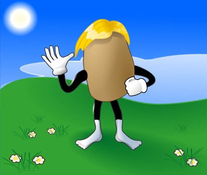

# Test for specifying image sizes in markdown

(c)

## small image

* no explicit size:

* only width specified `=100x`:

* only height specified `=x100`:

* both specified `=100x100`:

* only width, using html `4200x`:

* both specified, using html `4200x4200`:

## wide image

* no explicit size:

* only width specified `=100x`:

* only height specified `=x100`:

* both specified `=100x100`:

* only height specified, using html `x4200`:

* both specified, using html `4200x4200`:

## tall image

* no explicit size:

* only width specified `=100x`:

* only height specified `=x100`:

* both specified `=100x100`:

* both specified, using html `4200x4200`:

